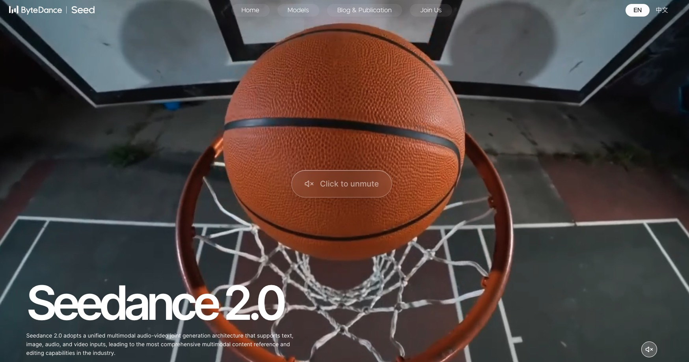
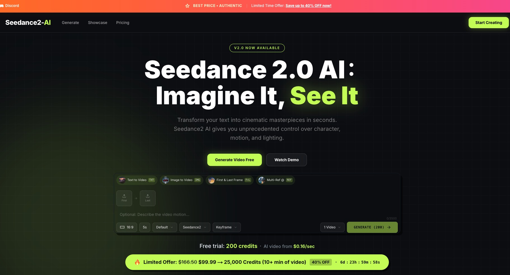
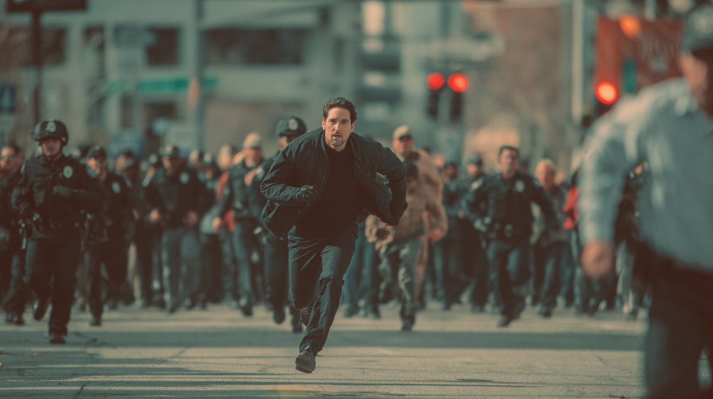

# Awesome Seedance 2.0 Prompts Libary (Updated: March 6, 2026)
This is a collection of the best prompts and videos for Seedance 2.0. Learn to make cinematic AI videos with ease here.

## 📖 Table of Contents
* [💗 What Is Seedance 2.0?](#-what-is-seedance-20)
* [🤔 How to Access Seedance 2.0?](#-how-to-access-seedance-20)
* [🔥 Featured Prompts + Videos](#-featured-prompts)
* [🚀 How to Write Seedance 2.0 Prompts?](#-how-to-write-seedance-20-prompts)
* [📄 About this Project](#-about-this-project)

## 💗 What Is Seedance 2.0



**Seedance 2.0** is a multimodal video model launched by ByteDance in February 2026. It supports four modalities of input: **image, video, audio, and text**, offering richer expression and more stable generation results.

| Core Dimension | Seedance 2.0 Capabilities |
| :--- | :--- |
| **Image Input** | • Up to **9 images** <br> • Size: Less than **30 MB** |
| **Image Formats** | jpeg, png, webp, bmp, tiff, gif |
| **Video Input** | • Up to **3 videos**, total duration **[2, 15] s** <br> • Size: Less than **50 MB** <br> • Total pixel range: [409,600 (480p) to 927,408 (720p)] <br> *(Note: Using reference videos may be slightly more "expensive")* |
| **Video Formats** | mp4, mov |
| **Audio Input** | • Up to **3 files**, total duration ≤ **15s** <br> • Size: Less than **15 MB** |
| **Audio Formats** | mp3, wav |
| **Text Input** | Natural Language |
| **Generation Duration** | **≤ 15s**, selectable between 4–15s |
| **Audio Output** | Built-in sound effects / Background music |
| **Interaction Limits** | The total limit for mixed input is **12 files**. Priority should be given to materials that significantly impact visual composition or rhythm. |


## 🤔 How to Access Seedance 2.0

Right now, there is **no single global entry** for Seedance 2.0.  
Most official platforms are designed for users in China, so they usually require a **Chinese phone number** and sometimes a **VPN**.


The table below shows the main options and their requirements.

| Access Method | Platform | Requirements | Notes |
|---|---|---|---|
| **Official Website** | [Jimeng](https://jimeng.jianying.com/)| Chinese phone number + VPN | Official Seedance access via web |
| **Official Website** | [Capcut](https://dreamina.capcut.com/) | None | Seedance 2.0 was previously available, but it is **currently disabled** |
| **Official App** | DouBao | Chinese phone number + VPN | Official mobile access |
| **Official App** | Xiaoyunque | Chinese phone number + VPN | Seedance features are integrated in the app |
| **Third-Party Website** | [Seedance2-AI](https://seedance2-ai.ai/) | No Chinese phone number, no VPN | New users receive **200 free credits** |



No matter which method you use, **Seedance 2.0 currently has a long queue** because demand is very high.

Most users report waiting: **2–10 hours** before their video is generated.

This happens because the model is still limited in computing capacity and many creators are trying it at the same time.

## 🔥 Featured Prompts

### Cinematic Mastery

| Prompt (Expand to Copy) | Reference Image | Final Result |
| :--- | :--- | :--- |
| <details><summary>View Full Prompt</summary><br>`The camera follows a man in black fleeing rapidly, pursued by a crowd. The shot transitions to a side-tracking view. In panic, the man crashes into a fruit stand by the roadside, quickly scrambles up, and continues running amidst the chaotic sounds of the crowd.`</details> |  | <video src="https://github.com/user-attachments/assets/6d9ea82c-5b82-457e-be6d-41dd9b39de28" width="320px" controls></video> |

📌 Details  

Author: Btydance

Source: [Btydance official guide](https://bytedance.larkoffice.com/wiki/A5RHwWhoBiOnjukIIw6cu5ybnXQ)  

Published: February 5, 2026

### No.2 Dog Vlog

🎬 **Video**


https://github.com/user-attachments/assets/bce09650-4cb8-479c-b8e1-36264ba2d145

📝 **Prompt**
```text
[Scene and Subject] A small white Pomeranian wearing adorable pajamas stands on its hind legs in front of a bright bathroom sink, facing a large mirror. [Action and Camera Movement] 0-3 seconds: The opening is a close-up of the mirror. The dog holds a pink toothbrush larger than its face in one paw and a phone in the other, taking a selfie in the mirror. It tilts its head curiously and clumsily tries to put the toothbrush in its mouth. 3-7 seconds: The camera switches to a medium shot behind the dog (mimicking a phone on a tripod). The dog starts brushing its teeth diligently, up and down, left and right, white foam bubbling from its mouth. 7-10 seconds: The camera slowly zooms in on its face. As the dog brushes, it suddenly winks at its reflection (and the camera), giving a super cute "smile," before continuing to brush its teeth intently. [Sound and Atmosphere] The entire sequence is accompanied by the soft vibration of an electric toothbrush (this playful sound can be simulated even with a non-electric one). Upbeat ukulele music plays in the background. The puppy occasionally makes muffled "woof woof" sounds while brushing its teeth, almost like humming a song. Finally, when it blinks, a cute sound effect (like a "ding") plays.
```

📌 Details  

Author: @Seedance2A8340  

Source: [Twitter Post](https://x.com/Seedance2A8340)  

Published: March 5, 2026

### No.3 BRAIN DRAIN

🎬 **Video**

https://github.com/user-attachments/assets/703ce1d2-3e4f-466a-8760-632d111822d6

📝 **Prompt**
```text
Hyperrealistic miniature diorama, stop-motion animation, handcrafted tactile materials — real fabric, clay, wire armatures, actual tiny props. A clay man sits at a miniature desk in a cozy office, a real tiny laptop open in front of him glowing with a familiar chat interface — white screen, alternating grey and white bubbles. His clay head is in cross-section — one half of his skull open like a hinged lid revealing a plump, healthy, pink clay brain filling the entire cavity. He types a question. [cut] The chat responds — a grey bubble appears. He smiles. In stop-motion the brain shrinks slightly, a tiny gap appearing between brain and skull. He doesn't notice. He types again. [cut] Rapid montage — each question fired off in quick stop-motion. With every sent message the brain shrinks one click smaller — plump to walnut to grape to pea. The empty skull space fills with real tiny cobwebs, a miniature tumbleweed rolls through, a small 'FOR RENT' sign pops up on a tiny stake inside his head. [cut] Close-up of the skull interior — the brain is now a single tiny pink crumb rattling around the bottom of an enormous empty cavity. A real tiny echo visual — the crumb bounces off the walls like a screensaver. [cut] Wide shot — the man leans back with a huge satisfied clay grin, arms behind his head, feet on the desk. The laptop screen shows hundreds of conversations in the sidebar. On the wall behind him, framed diplomas gather real dust. A real tiny spider has built a web between his ear and his shoulder. He looks completely content. The brain crumb settles in a corner and stops moving
```

📌 Details  

Author: @AleRVG  

Source: [Twitter Post](https://x.com/AleRVG)  

Published: March 4, 2026

### No.4 The vibrant modern cityscape of Zibo

🎬 **Video**

https://github.com/user-attachments/assets/b9706438-7fe8-49f3-8842-d00c537c855e

📝 **Prompt**

```text
The vibrant modern cityscape of Zibo, the majestic night view of the landmark Haidai Tower, intertwine with the antique architecture of Zhoucun Ancient Town. The visuals feature a rich variety of rapidly shifting scenes, from colorful glassworks to bustling city traffic. The camera pans rapidly in sync with the strong musical rhythm, quickly zooming in on grand architectural panoramas and employing stretching and blurring transitions. Strong neon lights sweep across the screen with dynamic light trails. The vibrant and bright color scheme, a blend of traditional Chinese and modern aesthetics, and 4K high definition create a visually striking experience. The sound effects include powerful, rhythmic drum beats and a modern electronic music mix.
```

📌 Details  

Author: @SVD_Studio_0 

Source: [Twitter Post](https://x.com/SVD_Studio_Q/status/2028376637516214365?s=20)  

Published: March 2, 2026


### No.5 Golden eagle flying through a city and landing

🎬 **Video**

https://github.com/user-attachments/assets/7f752298-b0c8-4057-a428-7e9488d921c7

📝 **Prompt**

```text
Hyper-realistic cinematic footage: A golden eagle takes off from a rocky cliff at dawn, wings spread, feathers clearly visible with aerodynamic drag. It glides forward, banking left to avoid a hanging construction crane cable, then climbs sharply over a rooftop antenna array. Wings flex slightly under air resistance, primary feathers bending independently, interacting realistically with the airflow. Breath steam is faintly visible in the cold morning air during a close flyby. The camera tracks parallel at a medium distance using stabilized aerial equipment, with slight natural shake from wind turbulence. The background reveals a dense city skyline enveloped in morning mist, low-angle eastern sunlight casting long shadows across glass facades. As the eagle's downdraft interacts with the environment, the wind blows loose dust and confetti on the roof. The eagle approaches the roof of a modern concrete high-rise. Through controlled wing flaps, momentum gradually decreases, talons extend forward, muscles visibly tense, and micro-adjustments are made for balance. It lands firmly on a large metal rooftop sign that reads "Ambition". Talons grip the metal surface, causing slight vibration and audible metallic resonance. Center of gravity shifts forward then stabilizes. Feathers naturally fall into place. The eagle scans the horizon with subtle head twitches and blinks. Maintain stable temporal consistency. Avoid unnatural frame interpolation. No exaggerated slow motion. Realistic physics, accurate center of gravity shifts, true avian anatomy, environmental reaction to forces.
```

📌 Details  

Author: OwnDay1819  

Source: [Reddit Post](https://www.reddit.com/r/seedance/comments/1ri3ctl/testing_physics_temporal_consistency_golden_eagle/)  

Published: March 1, 2026

### No.6 Jujutsu Kaisen fighting scenes

🎬 **Video**

https://github.com/user-attachments/assets/04519cf2-f99c-4f57-85ea-fc56b1f54ace


📝 **Prompt**

```text
The game features a colorful manga style, reminiscent of Jujutsu Kaisen, with a sense of decay and oppression. The positioning of the two characters and their surrounding environment are shown in Figure 1. The first shot: Yuuta Otsukoku (Figure 3) stands amidst the ruins, looking at Sukuna (Figure 2), and coldly utters in Japanese: "Domain unfolds." Simultaneously, the screen turns pure black, displaying four large white characters: "True or False Love," accompanied by Otsukoku's Japanese monologue. The second shot: The camera zooms out, revealing a large amount of flowing blue magical energy. Countless dilapidated crosses and swords rise from the ground (Figure 1). The third shot: One of the swords automatically flies into Otsukoku's hand, releasing blue magical energy.
```

📌 Details  

Author: Traditional-Table866

Source: [Reddit Post](http://reddit.com/r/ChatArt/comments/1rf5mi2/sharing_some_tips_for_using_seedance_20_on_chatart/)  

Published: February 27, 2026

### No.7 Airplane transforms into mecha robot

🎬 **Video**

https://github.com/user-attachments/assets/60902aa1-6b26-409a-adc7-357517ce2741

📝 **Prompt**

```text
9:16 Vertical screen mobile phone shooting perspective, real passerby live recording footage, slight handheld shaking, automatic exposure adjustment, focus adjustment, real environmental sound recording, distant city skyline clearly visible. An airport runway near the city center, with a modern metropolis of towering buildings in the background. A large twin-engine wide-body passenger jet is making a low-altitude approach, preparing to land, landing gear already down, the roar of engines deafening. Just before touchdown, the aircraft's fuselage begins to undergo mechanical restructuring—wings fold and disintegrate, fuselage panels slide and unfold, complex metal parts are precisely assembled, hydraulic structures extend and rotate, gears and armor plates are rapidly reconstructed. Highly complex industrial-grade mechanical transformation animation, realistic metal materials, substantial weight, and extremely precise mechanical details. The aircraft completely transforms into a giant metal robot, shattering the runway upon landing, sending debris flying and shockwaves spreading. The robot then rushes into the city, running at high speed, its footsteps crushing asphalt, collapsing streetlights, overturning cars, shattering building windows, and filling the air with smoke and dust. Featuring hyper-realistic, cinematic visuals, a realistic physics-based destruction system, dynamic lighting and shadows, particle effects, and stunning explosions. While maintaining a "live-streaming mobile phone quality" feel, it boasts Hollywood-level visual effects and IMAX-level detail.
```

📌 Details  

Author: mhu99

Source: [Reddit Post](https://www.reddit.com/r/singularity/comments/1rblgp0/just_with_a_single_prompt_and_this_result_is/)  

Published: February 23, 2026

## 🚀 How to Write Seedance 2.0 Prompts?

To create better videos with Seedance 2.0, structure your prompt around these six key dimensions:

Before we start, here are two common questions.

**1. Do I need to follow the order of the six dimensions?**  
No. Just write your prompt in a natural way.

**2. Do I need to include all six dimensions?**  
No. Use only what you need.

If you **skip a dimension**, the model will use **default settings or generate freely**.

The table below helps you quickly understand how to write prompts.

| Dimension | Key Question | Example | Skip if Not Needed |
|---|---|---|---|
| **Input** | What source material is used? (image, video, audio) | Upload a file and reference it with **@** (e.g., use the dance move from **@video1**) | ✓ |
| **Content** | What is happening in the scene? | Character + scene + action + mood (e.g., a girl dancing on the street, relaxed and energetic, using the dance move from **@video1**) |  |
| **Style** | What visual or music style do you want? | Artistic style + lighting + texture + music (e.g., Studio Ghibli style, warm tones, soft piano BGM) | ✓ |
| **Camera** | How should the scene be filmed? | Shot type + camera movement + angle (e.g., medium shot, slow push-in, eye level) | ✓ |
| **Structure** | What is the timeline or sequence? | Describe timing (e.g., 0–3s start dancing, 3–6s spin, 6–10s finish pose) | ✓ |
| **Edit** | Do you want to modify something? | Specific edit request (e.g., replace the cat in **@video1** with a dog) | ✓ |

### Input

This is the entry layer for Seedance 2.0. It shows which files you can use and what they do. It answers one simple question: What should the AI model follow?

You can use the @ symbol to tag three types of assets:

| Input | Use Case |
|------------|--------------------|
| @image | First/last frames, character looks, textures, and scenes. |
| @video | Camera movement, actions, effects, and style. | 
| @audio | Music, voice style, mood, and rhythm. |

When using these assets in your prompts, use the following simple sentence structure:

**Standard Format:**
```text
@[Asset A] as [Use Case], @[Asset B] for [Use Case], @[Asset C] for [Use Case]
```

**Example:**
```text
@Image1 as first frame, @Video1 for camera movement, @Video2 for character motion, @Audio1 for background music
```

### Content
This is the Narrative Core. It answers one simple question: What is happening in the scene?

This layer only describes the story. It does not describe camera angles or timelines. You can think of it like this: What is the actor doing on set? (Ignore the camera for now).

| Element | Meaning |
|------------|--------------------|
| Style| Chinese animation / Commercial / Film / Documentary... |
| Character | Who? Their identity / Appearance / Current state |
| Environment |Where? Lighting / Time of day / Weather |
| Action | What is happening? How are they doing it? |
| Mood/Vibe| Calm / Tense / Warm / Oppressive... |
| Lines/Narration | What is being said? |
| Sound Effects | Footsteps / Crowd noise / Ambient sounds... |

When using these assets in your prompts, use the following simple sentence structure:

**Standard Format:**
```text
[Style]. @[Asset] [Character] in [Environment] is [Action]. [Character] with [Emotion] says "[Lines]". Background is [Sound Effects].
```

**Example:**
```text
Commercial Style. The girl from @Image1 is by the window in the early morning. She slowly lifts a cup of coffee and takes a sip. She smiles and whispers, "So good." Relaxed and happy music plays in the room.
```

### Style

This layer sets the **look and the sound** of the video.

It answers two questions:

- What does it **look like**?
- What does it **feel like to hear**?

The goal is to give the video **one clear mood**.  
It sets the tone for the image, light, color, texture, and music.

This dimension includes:

- **Visual style** (photo, animation, Chinese style, film look, etc.)
- **Lighting** (light setup, shadows, texture light, god rays, Rembrandt lighting)
- **Color tone** (main color, color palette, dark tone, high saturation, overexposure)
- **Texture** (film grain, soft blur, sharpness, glow, layered depth)
- **Atmosphere** (luxury, moody, lazy, mystical, healing, premium feeling)
- **Music style** (rhythm, emotion, transitions, beat sync, instruments)

A simple way to write it:

First set the **overall style**.  
Then add lighting, color, texture, mood, and music.

This helps the model understand the **vibe of the video** from the start.

You can write it like this:

• **Visual Style:** XXX  
• **Lighting:** XXX  
• **Color Tone:** XXX  
• **Texture:** XXX  
• **Atmosphere:** XXX  
• **Music:** XXX  

Example:

• **Visual Style:** Portrait photography style, mixed with dreamcore and Liaozhai fantasy

• **Lighting:** Strong gray side light with Rembrandt lighting, texture light mixed with natural light, visible god rays

• **Color Tone:** Purple as the main color, dark base tone, some bright highlights and overexposure

• **Texture:** Film grain, soft long-shutter blur, rich layers, glowing gold and silver jewelry

• **Atmosphere:** Elegant and luxurious, slightly mystical, relaxed and moody, loose hair moving in the air

• **Music:** Calm and relaxed before the outfit change; classical music with strong beat sync after the change

### Camera

This layer answers the question: How does the camera move? It does not care about what is being filmed (the previous layer handles that). 

In a real movie set, this is where you focus only on the camera's path and ignore the actor's lines or expressions.

To get the best results, use these five elements:
| Element | Examples |
|------------|--------------------|
| Shot Size | Long shot / Medium shot / Close-up / Extreme close-up... |
| Camera Angle | Eye level / High angle / Low angle / POV (First-person)... |
| Movement | Static / Zoom in / Zoom out / Pan / Tilt / Crane shot... |
| Camera Rules | One-take / No cuts / Match cut... |
| Movement Speed | Slow to fast / Steady / Subtle handheld shake... |

Important: When describing camera language, use rules, not adjectives.

Don't write: "High-quality" or "Cinematic feel."

Do write: "One-take," "Steady follow shot," or "Transition from medium to close-up."

**Standard Format:**
```text
From [Camera Angle], [Movement] to [Shot Size], using [Camera Rules].
```

**Example:**
```text
Based on the outdoor scene in @Image1, use a first-person POV to fast zoom into a medium shot of the cabin interior. A deer (@Image2) and a sheep (@Image3) are chatting by the fire. Zoom in further to a close-up of the teacup. No cuts, one-take throughout.
```

### Structure

This section acts as the pre-production layer for Storyboarding and Editing. It focuses on timing and sequence to ensure the final output has a professional rhythm.

Timeline & Sequence Layer
This layer answers the question: How does the time flow and connect? Its purpose is to control the rhythm precisely by the second, rather than relying on "feeling."

Key Components
To build this layer, you need to focus on:

- Timeline Splits: Breaking the prompt into specific segments (e.g., 0–3s, 3–6s, 6–9s).

- Segment Content: What happens in the frame or camera for each part.

- Transitions: How one segment moves to the next.

- Coherence Logic: Ensuring the story flows naturally.

How to Build Your Prompt
First, build your framework by splitting the time. Then, fill each segment with the Assets (I), Content (II), and Camera (III) details we discussed earlier.

**Standard Structure:**
```text
0–X seconds:

[I @Assets / II Content / III Camera]

X–Y seconds:

[I @Assets / II Content / III Camera]
(Note: Do you need a change in action or emotion here? How should the camera transition?)

Y–Z seconds:

[I @Assets / II Content / III Camera]
(Note: Is there a plot twist or a key piece of information?)

Ending (Optional):

[Closing Method: Freeze frame / Camera stop / Lingering emotion]
```

**Example:**
```text
0–3s: An alarm clock rings; the room appears with a blurry, "dreamy" look.

3–10s: A fast pan reveals a close-up of a man’s face.

10–12s: A girl pouts and hides under the covers.

12–15s: Cut to a full-body shot of the man; he sighs and says, "I give up with you!"
```

### Edit

This section covers the video editing capabilities of Seedance 2.0. It is designed for when you have an existing video and want to modify it rather than starting from scratch.

This layer answers the questions: What do I want to change, and how do I change it?

4 Types of Video Editing:

| Editing Type | Usage |
|------------|--------------------|
| Extend | Connects to the final frame and adds [X] more seconds.
| Partial Edit Modifies | specific elements, such as hair color or clothing. |
| Replace | Keeps the overall scene but replaces the protagonist or product. |
| Re-Plot | Keeps the characters and environment but rewrites the entire story. |

How to Write Editing Prompts?

Define the Type: 

- Start by stating if you are extending, replacing, or re-plotting.

- Specify the Target: Clearly mark which part needs changing. Is it from second X to Y? A specific action? A certain element?

- Set Constants: Emphasize what must stay the same, such as the art style, camera movement, scene, or character consistency.

**Standard Format:**
```text
[Action] @Video1 (Extend by [X]s / Re-plot / Replace [A] with [B]), [New Details: I @Assets / II Content / III Camera], while keeping the original [Style/Camera/Character].
```

**Example:**
```text
Re-plot @Video1. The character picks up the phone instead of walking away. Use @Image1 for the new phone design. Keep the original cinematic lighting and medium shot camera angle.
```


## 💗 7 Essential Video Prompt Categories & Examples

When you face Seedance 2.0 and don’t know where to start, using a prompt template is the easiest way.  
Replace the words in **___** with your own ideas and generate your first video.

---

### 1. Cinematic Mastery

If you want a movie-like scene, focus on **camera movement, lighting, and atmosphere**.

**Prompt Template**

```
Cinematic film style. ___ (main character) in ___ (location).

Camera ___ (camera movement).
Lighting ___ (lighting style).

___ (main action happening).

Atmosphere: ___ (fog / rain / dramatic light).

End with ___ (epic final shot).
```

**Example**

Cinematic film style.  
A lone warrior stands in a ruined city at sunset.

Camera slowly pushes forward.  
Orange light shines through smoke.

The warrior walks forward and draws a glowing sword.  
Wind blows dust across the street.

End with a wide shot of the warrior standing against the burning skyline.

---

### 2. Anime & Animation

Anime prompts usually work best with **dynamic poses and dramatic action**.

**Prompt Template**

```
Anime style animation. ___ (character description).

Location: ___ (fantasy place / city / battlefield).

The character ___ (action or attack).

Energy / effects: ___ (light, magic, particles).

End with ___ (dramatic anime pose).
```

**Example**

Anime style animation.  
A young swordsman with silver hair.

Location: a floating island above the clouds.

He jumps into the air and swings his sword, releasing a glowing blue energy wave.

End with the swordsman landing and pointing the sword forward.

---

### 3. AI Short Series

AI short series prompts focus on **story, emotion, and dialogue**.

**Prompt Template**

```
___ style. ___ (character description) in ___ (place / time / mood).

___ (what happens / action).
___ (extra emotion or atmosphere).

Dialogue:
___ says, “___.”
___ replies, “___.”

End with ___ (final shot / subtitle / fade to black).
```

**Example**

Chinese animation movie style.  
A and B stand on a cliff at night. Moonlight shines. Sea fog moves around them.

They start far apart, then slowly move closer.  
A reaches out and stops B. A looks calm and firm.

Dialogue:

B says, “You want to control me again?”  
A replies, “I’m not trying to control you… I just don’t want you to get hurt.”

End with both of them standing side by side, looking at the sea.

---

### 4. Commercial & Ads

Commercial videos should highlight **product, lighting, and premium feeling**.

**Prompt Template**

```
Luxury commercial style.

A ___ (product) placed on ___ (surface / environment).

Camera ___ (slow rotation / macro shot).

Lighting ___ (soft light / dramatic light).

The product ___ (main highlight moment).

End with ___ (brand style final shot).
```

**Example**

Luxury commercial style.

A silver watch placed on a black marble table.

Camera slowly rotates around the watch.  
Soft light reflects from the metal.

The watch hands move slowly as tiny light reflections sparkle.

End with a clean close-up of the watch face.

---

### 5. Trending & Viral

Viral videos usually focus on **funny or surprising moments**.

**Prompt Template**

```
Social media viral video style.

___ (character or animal) in ___ (normal situation).

Suddenly ___ (unexpected event).

Reaction: ___ (funny or exaggerated reaction).

End with ___ (meme moment).
```

**Example**

Social media viral video style.

A cat sits calmly in a small toy car.

Suddenly the car starts rolling downhill very fast.

The cat’s eyes go wide and it starts screaming.

End with the cat zooming past the camera.

---

### 6. Realistic Vlog/UGC

UGC videos should feel **casual and real**, like smartphone recordings.

**Prompt Template**

```
UGC smartphone video style.

___ (person) recording themselves in ___ (daily place).

They talk about ___ (product / experience).

Natural lighting. Slight handheld camera movement.

End with ___ (casual closing moment).
```

**Example**

UGC smartphone video style.

A young woman recording herself in her bedroom.

She shows a skincare product and talks about how she uses it.

Natural daylight from the window. Casual tone.

End with her smiling and waving at the camera.

---

### 7. Creative VFX

These prompts focus on **visual effects and surreal visuals**.

**Prompt Template**

```
Experimental VFX style.

___ (object or character) made of ___ (particles / light / liquid).

The object ___ (transforms / explodes / reforms).

Visual effects: ___ (particles / energy waves / abstract motion).

End with ___ (final abstract visual).
```

**Example**

Experimental VFX style.

A human figure made of glowing particles.

## 📄 About This Project
This is a simple library of "AI video recipes." We share prompts that actually work.
- Copy and Paste: Use our prompts to get great results instantly.
- Save Time: No more guessing. Use proven workflows.
- Free Forever: Open to everyone.

⚠️ Copyright Notice:

All prompts are collected from the community (such as Reddit, X, WeChat, and other platforms) and are shared for educational purposes only. If you are a copyright owner and would like any content removed, please submit a removal request by opening an Issue with relevant details and proof of ownership.

The figure slowly breaks apart into thousands of lights.

Particles swirl through the air like a galaxy.

End with the particles forming a bright star.


